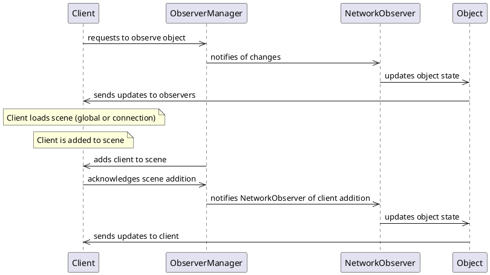

---
title: "FishNetFeatures"
author: [Research group 2]
titlepage: true
toc-own-page: true
toc: true
...

# Introduction

A small look at all fishnet features.
We also look if the function helps with Consistency or Scaleability.


# Features

## Server and Client Identification

Find out if your code is server or client. 
Also look how to identify clients.

The developer can check if instances have started.

```
using FishNet.Object;

public class Player : NetworkBehaviour
{
    public void OnStruck()
    {
        if (!IsClientStarted)
            return;

        // Play visual effect and sounds only on a client.
    } 
}
```

or assert code runs only on certain clients.

```
[Client]
void ShowUI()
{
    // This code will only run on a client, otherwise it will print a warning.
}
```

## Network State Events

The developer can take advantage of numerous available events.
These events are meant to stay informed about the current state of the network.

Here are a few:

- OnAuthenticationResult  
This event is called once a client has either been authenticated or failed to authenticate.
- OnRemoteConnectionState  
When a client's state changes 
(when a client connects or disconnects)
this event is called.
- OnAuthenticated  
When a local client has successfully been authenticated with the server,
this event is called. 
At this point a client will have an ID and will be added to the Clients list.
- Ticks  
These events pop on the given timespace.
They can be used for limiting, preparing and cleaning information.
The three timespaces are:
    - OnPreTick
    - OnTick
    - OnPostTick   

## Network communication

There are several ways to communicate over the network.
These methods are:

- Remote Procedure Calls
- SyncTypes
- Broadcasts

### Remote Procedure Calls

Remote Procedure Calls (rpc) are a type of communication that are received on the same object they are sent from.
A rpc is like calling a function on another machine or system.
The three types of rpc are:

- ServerRpc
- ObserverRpc
- TargetRpc

Rpc are object bound,
So they must be called on scripts which inherit from NetworkBehaviour.

A ServerRpc allows a client to run logic on the server.
By default only the owner can communicate with the server.

``` c# 
private void Update()
{
    // If owner and space bar is pressed.
    if (base.IsOwner && Input.GetKeyDown(KeyCode.Space))
        RpcSendChat("Hello world, from owner!");        
}

[ServerRpc]
private void RpcSendChat(string msg)
{
    Debug.Log($"Received {msg} on the server.");
}
```


To make the server run logic on clients a ObserverRpc can be used.
```C#
private void FixedUpdate()
{
    RpcSetNumber(Time.frameCount);
}

[ObserversRpc]
private void RpcSetNumber(int next)
{
    Debug.Log($"Received number {next} from the server.");
}
```

Lastly the TargetRpc is used to run logic on a specific client.
```c#
private void UpdateOwnersAmmo()
{
    /* Even though this example passes in owner, you can send to
    * any connection that is an observer. */
    RpcSetAmmo(base.Owner, 10);
}

[TargetRpc]
private void RpcSetAmmo(NetworkConnection conn, int newAmmo)
{
    // This might be something you only want the owner to be aware of.
    _myAmmo = newAmmo;
}
```

### Broadcasts

Broadcasts are used to allow sending messages to one or more objects,
without them requiring a NetworkObject.
Broadcasts must be structures, and implemnt IBroadcast.
```c#
public struct ChatBroadcast : IBroadcast
{
    public string Username;
    public string Message;
    public Color FontColor;
}
```
Since broadcasts are not linked to objects, they meust be send using the SErverManager or ClientManager.
```c#
public void OnKeyDown_Enter(string text)
{
    // Client won't send their username, server will already know it.
    ChatBroadcast msg = new ChatBroadcast()
    {
        Message = text,
        FontColor = Color.white
    };
    
    InstanceFinder.ClientManager.Broadcast(msg);
}
```

This system can also be used to send information from server to clients.

But another object needs to know if it's able to receive broadcasts.
```c#
private void OnEnable()
{
    // Begins listening for any ChatBroadcast from the server.
    // When one is received the OnChatBroadcast method will be
    // called with the broadcast data.
    InstanceFinder.ClientManager.RegisterBroadcast<ChatBroadcast>(OnChatBroadcast);
}

// When receiving on clients broadcast callbacks will only have
// the message. In a future release they will also include the
// channel they came in on.
private void OnChatBroadcast(ChatBroadcast msg, Channel channel)
{
    // Pretend to print to a chat window.
    Chat.Print(msg.Username, msg.Message, msg.FontColor);
}

private void OnDisable()
{
    // Like with events it is VERY important to unregister broadcasts
    // When the object is being destroyed(in this case disabled), or when
    // you no longer wish to receive the broadcasts on that object.
    InstanceFinder.ClientManager.UnregisterBroadcast<ChatBroadcast>(OnChatBroadcast);
}
```

## Area of Interest

Fish-Networking has an advanced network area of interest system,
used for controlling which client's receives information about what objects.

An observer is a client which can see an object and communicate with it.
If a client is not an observer it will not receive a network response or callback.

Fish-Networking comes with a NetworkManager prefab which contains the recommended minimum components to begin working on a new project. Within that prefab is the ObserverManager with an included Scene Condition. If you have not familiarized yourself with the ObserverManager and condition types please do so now using the links above.




## Prediction

Prediction is the act of server-authoritative actions while allowing clients to move in real-time without delay.

Client-side prediction is a technique used to move in real-time on clients,
providing responsiveness actions,
while also ensuring such actions cannot be cheated.
This feature is baked into Fish-Networking.
But the developer needs to do some things.

- Configure PredictionManager
- Configure TimeManager
- Configure NetworkObjects

State forwarding will allow the same inputs to run on all clients as they do on the server. 
This can be useful if you want all clients and server to run the same input based logic, 
similar to if the client or server owns the object. 
State forwarding is more CPU intensive as it means a state buffer must be kept,
and the object must reconcile to make corrections as well re-run past states.

To make predictions developers need to make certain structs.
A struct inheriting from IReplicateData and a struct inheriting from IReconcileData.
These are typacily send during the OnTick.
Then the reconcileData can be looked at in OnPostTick.

## Lag Compensation

Lag compensation is also known as collider rollback.
It's the act of placing colliders back in time on the server to provide accurate raycast hit detection regardless of client latencyy.
To utilize the lag compensation you must also add the RollbackManager script to your Networkmanager object.

# Conclusion

A short sum up of the features and where they fit.

#### Consistency
* **Prediction**: Ensures that client-side actions are validated by the server, preventing cheating and maintaining consistency across all clients. (Client-side prediction, State forwarding, IReplicateData, IReconcileData)
* **Lag Compensation** (Collider Rollback): Helps maintain accurate collision detection by placing colliders back in time on the server, ensuring consistency across clients with different latencies.
* **Network State Events** (e.g., OnAuthenticationResult, OnRemoteConnectionState, OnAuthenticated): Keep clients informed about the current network state, ensuring consistency across all clients.

#### Scalability
* **Area of Interest** (ObserverManager, Scene Condition): Optimizes network traffic by only sending information to clients that are interested in a specific area or object, reducing unnecessary data transmission.
* **Broadcasts**: Allows sending messages to multiple objects or clients without requiring a NetworkObject, reducing the number of network messages and improving scalability.

#### Both (Consistency and Scalability)
* **Remote Procedure Calls** (RPCs: ServerRpc, ObserverRpc, TargetRpc): Ensure consistency by running logic on specific clients or the server, while also improving scalability by reducing the number of network messages.
* **Server and Client Identification**: Helps ensure consistency by identifying clients and servers, while also improving scalability by allowing for targeted communication.
* **Ticks** (OnPreTick, OnTick, OnPostTick): Provide a framework for synchronizing game logic across clients and servers, ensuring consistency and scalability.

